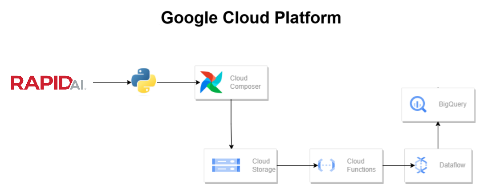

# Global_Covid_Statistics_ETL_project
An ETL project constructed from scratch to depict covid statistics in 267 cities across countries globally.

## Introduction
This project leverages Google Cloud Platform to depict the real time data changes in the Covid statistics of the countries worldwide. The data is fetched from the rapid.ai to the cloud stroage, processed to the Big Query via the DataFlow. The whole process is automated by Apache Airlfow and the Cloud Function that triggers the DataFlow job to lead data into the BigQuery upon receiving a new csv file. 

## Project Architecture

## Technology and services used
1 - Extraction and staging
- Python Libraries: Json, requests, pandas, google.cloud
- Google Cloud Service: CloudStorage
2 - Transformation
- Google Cloud Service: DataFlow
3 - Loading
- Google Cloud Service: BigQuery
4 - Automation
- Apache Airlfow (to automate the extraction from the rapid.ai)
- Python Libraries: googleapiclient.discovery
- Google Cloud Service: CloudFunction (to automate the DataFlow job)

## Dataset Information
The dataset sustains COVID-19 statistics for multiple provinces of 247 different cities belonging to countries worldwide. It provides the number of confirmed cases, deaths, and recoveries, along with the calculated fatality rate for each city and province.

Extracted Data for the region info and the respective covid data: https://github.com/Omamaa16/Global_CovidStats_ETL_Project/blob/bfc664b779984c01961476874f60ca0df591d86a/covid_data.csv

Extracted Data for the region info: https://github.com/Omamaa16/Global_CovidStats_ETL_Project/blob/f3961b9015fd3c03e5997070cbe26f7fd1163db2/region_data.csv

Original Dataset from the rapid.ai: https://rapidapi.com/axisbits-axisbits-default/api/covid-19-statistics/playground/apiendpoint_aad07092-4297-48f8-ae76-849cf549b192

## Scripts Used
1 - Extraction
- [Extracting regions info](extraction_regions_info.py)
- [Extracting the data from covid and combining with the regions info to obtain a combined extracted file](combined_data.py)
  
2 - Automating the extraction from the rapid.ai.
- [Using Apache Airlfow to automate the extraction process from the rapis.ai](dags.py)
  
3- Manual mapping of the schema for the BigQuery table.
  [Schema](bigquery_schema.json)

4 - Making a trigger in the cloud function
- [Once a new csv file is retrieved in cloud storage, the cloud function triggers the data flow job and the data is dumped to the BigQuery](cloud_function.py)

 
